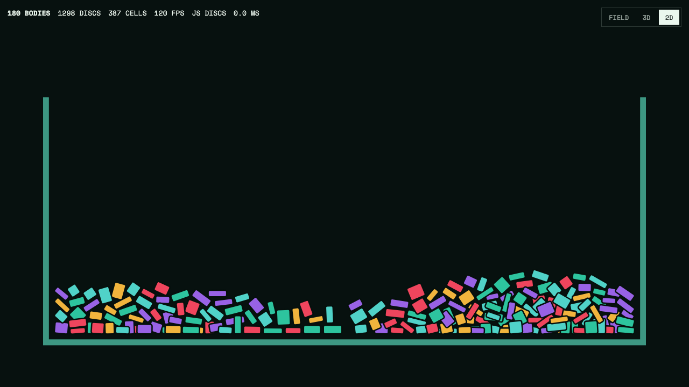

# Particle Crate

Human-controlled browser physics sketch for piles of little rigid things.

The important rule: nothing moves unless the user touches it, tilts it, opens the crate, or pulses the pile. It should feel like objects on a table, not a screensaver.

[Live demo](https://maxpetrusenko.github.io/particle-crate/)



Demo video: [2D freeze and shove MP4](docs/assets/particle-crate-2d-freeze-demo-10s.mp4)

## What It Is

Particle Crate is a small CPU-only browser physics lab inspired by Yacine's rigid body and voxel-particle posts:

- https://x.com/yacineMTB/status/2068358519460360637
- https://x.com/yacineMTB/status/2068699495102108131

It has three modes:

| Mode | What it shows | Main interaction |
| --- | --- | --- |
| `FIELD` | 3D particle field with free particles and locked voxel clusters | Drag heap/rim/apron, tilt gravity, open wall |
| `3D` | Boxy crate objects with camera orbit, pull, stir, sleep | Drag blocks or stir floor |
| `2D` | Fast compound-disc pile inside an open crate | Drag through the pile |

This is not CUDA and not trained. It is a browser prototype built with Three.js, typed arrays, and a hand-written 2D compound-disc solver.

## What We Achieved

- Objects start still.
- Idle 2D, 3D, and field particles do not drift, drip, fall, or boil.
- User input injects energy.
- After interaction, the simulation resolves briefly and freezes again.
- 2D pieces are compound bodies, not single circles.
- The crate has an open-rim behavior instead of an invisible lid.
- The 3D field has finite-height walls, an outside apron, a lowerable front wall, tilt gravity, recycle, and HUD metrics.

The current demo is intentionally a small local physics loop, not a production simulator.

## How To Use

Open the [live demo](https://maxpetrusenko.github.io/particle-crate/) or run it locally.

Controls:

| Input | `FIELD` | `3D` | `2D` |
| --- | --- | --- | --- |
| Drag object/pile | Stir particles and voxel clusters | Pull or stir blocks | Shove compound discs |
| Drag empty space | Orbit camera | Orbit camera | No-op |
| Wheel/trackpad | Zoom camera | Zoom camera | Browser zoom only |
| `Space` | Pulse the packed bed | Drop/excite bodies | Drop batch |
| `R` | Reset | Reset | Reset |
| `O` | Lower/raise front wall | No-op | No-op |
| `G` | Toggle agitation | No-op | No-op |
| WASD/arrows | Tilt gravity | No-op | No-op |

If nothing is being touched, the pile should stay still.

## Run Locally

```sh
npm install
npm run dev -- --port 4173
```

Then open:

```text
http://127.0.0.1:4173
```

Build static files:

```sh
npm run build
```

## Verify

```sh
npm run check
```

`npm run check` runs syntax checks, a production build, and headless browser QA over desktop and mobile viewports.

The QA asserts:

- no console errors;
- nonblank WebGL and 2D canvases;
- default `FIELD` mode with particles plus locked voxel clusters;
- no falling-rain spawn;
- idle immobility before user input in `FIELD`, `3D`, and `2D`;
- closed-wall containment;
- rim and outside field control;
- open-front spill to the apron;
- recycle behavior;
- legacy 3D pull, stir, and settling;
- 2D pointer shove and open-rim escape.

## Architecture Notes

- `src/sim.js`: main app, mode switching, Three.js scene, debug hooks.
- `src/engines/particleField3d.js`: typed-array 3D particle field.
- `src/mode2d.js`: 2D mode shell and canvas interaction.
- `src/engines/handmade.js`: hand-written compound-disc 2D solver.
- `scripts/qa.mjs`: Playwright proof gate.

Three.js and OrbitControls are vendored from the pinned npm package so GitHub Pages does not depend on a CDN or build server.

## Status

Stage 5. Good enough as a visible browser demo. Still missing real GPU compute, broad-phase optimization for larger piles, true rotational voxel cluster physics, and a more serious UI for comparing solver modes.
